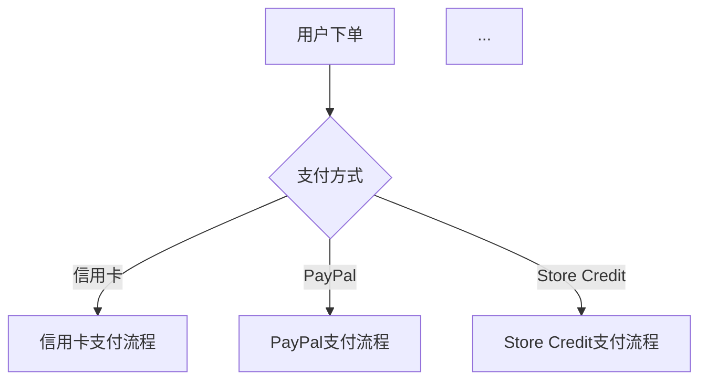

# Business-Driven Refactor

重构有两种起点：从代码结构出发（消除重复、深化模块），从业务意图出发（理顺被补丁扭曲的逻辑、让代码说清楚它服务的业务）。本技能做第二种。

**核心信念**：代码乱，往往不是工程师偷懒，而是业务本身被补丁糊乱了。不先把业务理清楚就动手重构，只是在整齐地整理垃圾。

## Glossary

使用这些术语精确描述发现。不要漂移到 "重复代码"、"模块耦合" 等结构视角——那些是代码层面的问题，本技能关注业务层面的不对齐。

**Business Process**（业务流程）
一个完整的、用户可感知的业务操作。例如："用户下单"、"退款处理"、"库存盘点"。不是技术概念（"请求进来 → handler 处理 → 返回响应"），是业务概念（"客户选中商品 → 填写地址 → 支付 → 收到确认"）。

**Patch Layer**（补丁层）
后来追加的需求修改，通常以条件分支、特殊处理、if-else 链条的形式附着在核心逻辑上。特征：读代码时能"看到时间"——先写了一段清晰的逻辑，后面不断追加 else/if/特殊 case。

**Intent Drift**（意图漂移）
代码当前的行为已经偏离了原始业务意图。不是 bug——功能能用——但代码说的"故事"和业务实际需要的"故事"对不上。典型信号：变量名叫 `pendingOrder` 但实际存的是"已支付未发货"，或者注释说"取消订单"但代码还发了发货通知。

**Core Flow vs Exception Flow**（核心流程 vs 异常/补丁流程）
业务的主路径（占比 >80% 的调用）vs 边界情况、后加的特殊处理。补丁出问题的常见模式：异常流程的代码量和复杂度超过了核心流程，读代码的人迷失在边缘情况里。

**Logic Fragmentation**（逻辑碎片化）
一条完整的业务规则被拆散在多个文件/handler/函数中，要理解"退款到底做了什么"需要追踪 5 个文件。不是普通的模块拆分——拆分后的每个碎片单独看都不表达完整的业务含义。

**Business Invariant**（业务不变量）
无论代码怎么改，这条规则不能破。例如："已发货的订单不能取消"、"退款金额不能超过实付金额"。很多 bug 的根源是补丁破坏了不变量。

**Ghost Logic**（幽灵逻辑）
代码中存在但业务上已经不再需要的逻辑。旧功能的残留，因为没人敢删。特征：问 "这段代码能删吗？" 没人能回答。

## Process

### Phase 1: Code Archaeology

**目标：从代码和 git 历史中重建业务地图。不要问用户——先自己挖。**

#### 1.1 找到所有业务入口

扫描当前代码，找出所有业务入口：API endpoint、CLI command、消息队列消费者等。对每个入口建立初始印象——这个入口在业务上干什么？按业务领域分组（订单、支付、退款、库存…）。

#### 1.2 顺藤摸瓜，追踪每个业务流程

对每个入口，沿调用链向下读代码。用 "业务视角三问"：

1. **这个入口在业务上干什么？** 不要用技术语言回答。不是说 "这个 handler 接收 POST 请求然后调用 OrderService"，而是说 "用户在结算页面点'提交订单'"。

2. **主路径是什么？** 追踪 happy path——80% 的请求走的那条路。标记每一步：验证了什么？改了什么状态？触发了什么副作用？

3. **分支是什么？** 找到所有 if/else、switch、early return。每个分支对应什么业务条件？是核心流程的一部分，还是后来加的补丁？

追踪过程中，遇到代码意图不清晰的地方，查 git blame 看这段是谁、什么时候、因为什么加的。遇到被注释掉的代码，查 git log 看注释时发生了什么。

记录格式：

```
业务：用户退款
入口：POST /api/refund
主路径：
  1. 查订单状态 → 只允许"已支付"状态退款
  2. 计算退款金额 → 订单金额 - 已退款金额
  3. 调用支付网关退款
  4. 更新订单状态为"已退款"
分支：
  - if 订单状态 == "已发货" → 先调"intercept shipment"（git blame：2021年3月加入）
  - if 退款金额 <= 0 → 报错（git blame：2022年修 bug 加入）
  - if 支付方式 == "store_credit" → 走 store credit 退款（git blame：2022年11月新功能）
```

#### 1.3 识别 Patch Layer 的信号

代码中出现以下模式，标记为疑似补丁：

- **条件链**：`if type == "A" ... else if type == "B" ... else if type == "C"` —— 每种类型可能是在不同时间加的
- **"Also do X" 注释**：`// Also update the inventory` —— "Also" 暗示这是后来想起的
- **变量名与用途不符**：变量叫 `order` 但只存了订单的一部分字段，因为后来发现不需要完整订单
- **函数名有 "And"**：`createOrderAndNotifyAndLog` —— 函数在不断被追加职责
- **神奇的数字/常量**：`if (amount > 5000)` —— 5000 是哪来的？业务规则还是临时 hack？
- **被注释掉的代码块**：前一个人也不敢删

### Phase 2: Present & Confirm

**目标：把你重建的业务地图呈现给用户，逐项确认或修正。**

这是交互式讨论的核心阶段。不要一次性扔出所有发现——一项一项来，逐项确认。

#### 2.1 先呈现业务流程全景

用 Mermaid 流程图呈现你重建的业务流程全景：



然后确认：**"这是我根据代码重建的业务流程全景。有没有缺失的流程？有没有已经废弃但我还列出来的？"**

#### 2.2 逐项确认每个业务流程的细节

对每个流程，呈现你的追踪笔记，标注你的置信度：

```
✅ 高置信度（代码清晰，有测试佐证）：主路径退款流程
⚠️ 中置信度（代码有分支我推测了业务含义）：shipment intercept 的触发条件
❓ 低置信度（纯推测，代码里看不出业务原因）：为什么退款金额有个上限 5000
```

对每个中低置信度的项，追问用户确认。

#### 2.3 确认 Patch Layer 的时间线

呈现你识别的补丁层：

```
我识别到以下逻辑可能是后来追加的补丁：

1. Shipment intercept 逻辑 —— 2021年3月加入（git log 确认）
   → 业务背景是什么？现在还有这个需求吗？
2. Store credit 退款通道 —— 2022年11月加入
   → 这是独立功能还是对原有退款流程的修改？
3. 5000元退款上限 —— 代码里没有注释说明原因
   → 这是业务规则还是临时限制？
```

### Phase 3: Gap Analysis

**目标：找出业务意图和代码现实之间的不对齐。**

每一项发现用这个格式呈现：

```
【发现 #N】{一句话描述不对齐}

业务意图：{业务上应该发生什么}
代码现实：{代码实际做了什么}
影响：{这个不对齐导致了什么问题}
根源：{是什么导致了不对齐——补丁？历史原因？沟通失误？}
```

#### 3.1 常见的 Gap 类型

**类型 A：幽灵逻辑**
代码在做一件业务上已经不需要的事。
> "退款流程里有一段'发送短信通知'的逻辑，但业务上说退款通知已经统一改成 App 推送了。这段代码还活着，每次退款都白跑一次。"

**类型 B：碎片化**
一条业务规则分布在多个文件，拼起来才完整。
> "要知道'退款到底做了什么'，需要读 RefundHandler → PaymentGateway → OrderRepository → NotificationService，每个文件只做一部分，没有一个地方说清楚退款的完整业务含义。"

**类型 C：不变量被架空**
代码结构上允许了业务上不应该发生的事。
> "Order 状态机允许 '已退款 → 已发货' 的状态转换。代码上没有约束，只有前端按钮置灰。业务上说这绝对不该发生。"

**类型 D：补丁颠倒主次**
异常流程/补丁的代码量和复杂度压倒核心流程。
> "退款逻辑 200 行，其中 140 行处理各种特殊情况（store credit、gift card、部分退款、shipment intercept），核心的'原路退回'只有 20 行。读代码的人先看到 140 行边缘情况。"

**类型 E：命名背叛**
代码的命名和业务术语对不上，维护者无法通过业务语言定位代码。
> "业务上叫'redeem'，代码里叫 `useCoupon`。业务上叫'fulfillment'，代码里叫 `fulfill` 混着 `ship`。新人对着文档找不到代码。"

### Phase 4: Realignment Plan

**目标：为每个 Gap 提出理顺方案，和用户讨论优先级和风险。**

对每个选中的 Gap，按这个结构讨论：

#### 4.1 理想态：代码应该长什么样

用自然语言 + 伪代码描述：

```
理想态：退款应该是一个独立的 Refund 聚合

refund = Refund.create(order, amount, reason)
refund.execute(paymentGateway)
order.recordRefund(refund)

所有退款逻辑（原路退回、store credit 退回、gift card 退回）都在 Refund 内部，
调用方不需要知道退款有几种情况。
```

#### 4.2 迁移路径：怎么从现状到理想态，不破坏现有功能

核心原则：**先理顺结构，不改变行为。** 每一步都是可在测试保护下完成的小步。

```
Step 1: 提取 Refund 值对象，封装退款金额计算逻辑
Step 2: 将退款状态机从 Order 分离到 Refund
Step 3: 将各退款通道（原路退回 / store credit / gift card）收敛到 Refund 内部策略
Step 4: 删除幽灵逻辑（短信通知等）
```

每一步标注：
- 风险等级：低/中/高
- 需要改动的文件范围
- 可以用哪些现有测试做安全网
- 是否有 ADR 冲突

#### 4.3 记录决策

讨论过程中：
- **新业务概念被澄清** → 如果项目有 `CONTEXT.md`，写入其中。如果没有，在 Phase 4 结束时提议创建，把澄清的业务术语沉淀下来
- **一个不能动的业务不变量被确认** → 提议记录下来防止未来被打破
- **一个 Gap 决定不修** → 记录原因，防止未来重复分析

## When NOT to Use This Skill

- 代码结构明显有问题，但业务逻辑清晰 → 做结构重构即可
- 纯粹的技术债（性能、依赖升级、代码风格）→ 不在此技能范围
- 新功能开发（没有历史补丁需要考古）→ 直接设计和实现
- 能明确说出要改什么，只需要执行 → 直接动手

## Red Flags

- 用户说 "直接重构就行，不用管业务" —— 拒绝。不理解业务就动手，是在整齐地制造 bug。
- 代码考古阶段发现 git 历史混乱（commit 无意义、无 PR 描述）—— 诚实告知用户，Phase 2 会有更多低置信度项需要确认。
- 发现一个业务不变量既没有代码约束也没有测试保护 —— 标记为高优先级 Gap，先补测试再讨论重构。
