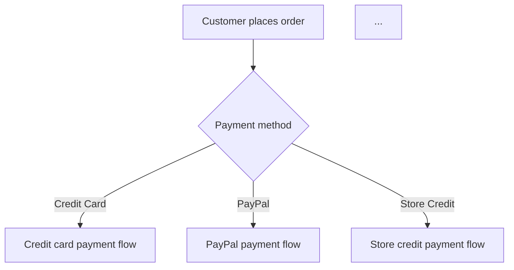

# Business-Driven Refactor

There are two starting points for refactoring: from the code structure (eliminate duplication, deepen modules), or from business intent (untangle patched logic, make the code say clearly what business it serves). This skill does the second.

**Core belief**: messy code is often not laziness — the business itself got patched up. Refactoring without first understanding the business just neatly organizes garbage.

## Glossary

Use these terms precisely to describe findings. Do not drift into "code duplication," "module coupling," or other structural lenses — those are code-level concerns; this skill focuses on business-level misalignment.

**Business Process**
A complete, user-visible business operation. Example: "customer places an order," "customer requests a refund," "inventory reconciliation." Not a technical concept ("request comes in → handler processes → response returned"), but a business concept ("customer selects items → enters address → pays → receives confirmation").

**Patch Layer**
Requirements added later, typically attached to core logic through conditional branches, special cases, and if-else chains. Signatures: you can "see time" reading the code — there was a clear piece of logic, then more and more else/if/special-case was appended.

**Intent Drift**
When the code's current behavior no longer matches the original business intent. Not a bug — the feature works — but the story the code tells and the story the business needs no longer align. Typical signal: a variable named `pendingOrder` actually stores "paid but not shipped," or a comment says "cancel order" but the code also fires a shipment notification.

**Core Flow vs Exception Flow**
The primary business path (>80% of invocations) vs edge cases and later patches. Common patch failure mode: exception flow code volume and complexity overwhelms the core flow — readers get lost in edge cases.

**Logic Fragmentation**
A single business rule scattered across multiple files/handlers/functions, so understanding "what does a refund actually do" requires tracing 5 files. Not ordinary modular decomposition — each fragment, alone, doesn't express complete business meaning.

**Business Invariant**
A rule that must not break no matter how the code changes. Example: "a shipped order cannot be cancelled," "refund amount cannot exceed amount paid." Many bugs originate from patches breaking invariants.

**Ghost Logic**
Code that exists but the business no longer needs. Residuals from old features nobody dared to delete. Signature: "can we delete this?" — nobody can answer.

## Process

### Phase 1: Code Archaeology

**Goal: reconstruct the business map from code and git history. Do not ask the user — dig first.**

#### 1.1 Find All Business Entry Points

Scan the current code for business entry points: API endpoints, CLI commands, message queue consumers, etc. Build an initial impression of each — what business operation does this entry point serve? Group by business domain (orders, payments, refunds, inventory, etc.).

#### 1.2 Trace Each Business Process

For each entry point, follow the call chain downward and read the code. Apply three business-perspective questions:

1. **What does this entry point do, in business terms?** Don't answer with technical language. Not "this handler receives a POST and calls OrderService," but "the customer clicks 'Place Order' on the checkout page."

2. **What is the main path?** Trace the happy path — the route taken by 80% of requests. Mark each step: what was validated? What state changed? What side effects were triggered?

3. **What are the branches?** Find all if/else, switch, early return. What business condition does each branch correspond to? Is it part of the core flow, or a later patch?

While tracing, when code intent is unclear, check git blame to see who added this, when, and why. For commented-out code, check git log to see the context around when it was commented.

Recording format:

```
Business: Customer refund
Entry point: POST /api/refund
Main path:
  1. Check order status → only "paid" orders allowed
  2. Calculate refund amount → order amount - already refunded
  3. Call payment gateway to refund
  4. Update order status to "refunded"
Branches:
  - if order status == "shipped" → call "intercept shipment" first (git blame: added March 2021)
  - if refund amount <= 0 → error (git blame: added 2022 bug fix)
  - if payment method == "store_credit" → use store credit refund channel (git blame: Nov 2022 new feature)
```

#### 1.3 Identify Patch Layer Signals

The following patterns in code should be flagged as suspected patches:

- **Condition chains**: `if type == "A" ... else if type == "B" ... else if type == "C"` — each type may have been added at a different time
- **"Also do X" comments**: `// Also update the inventory` — "Also" hints this was an afterthought
- **Mismatched variable names and usage**: a variable named `order` but only holds partial order fields, because full order wasn't needed at first and was never refactored
- **Functions with "And" in the name**: `createOrderAndNotifyAndLog` — the function kept getting responsibilities appended
- **Magic numbers/constants**: `if (amount > 5000)` — where did 5000 come from? Business rule or temporary hack?
- **Commented-out code blocks**: the previous person was also afraid to delete

### Phase 2: Present & Confirm

**Goal: present your reconstructed business map to the user, confirming or refining item by item.**

This is the interactive discussion core. Do not dump all findings at once — go item by item, confirming each.

#### 2.1 Start with the Business Process Landscape

Use a Mermaid flowchart to present the business process landscape you reconstructed:



Then confirm: **"This is the business process landscape I reconstructed from the code. Any processes missing? Any I listed that are already obsolete?"**

#### 2.2 Confirm Details of Each Business Process

For each process, present your trace notes with confidence levels:

```
✅ High confidence (code is clear, supported by tests): main path refund flow
⚠️ Medium confidence (code has branches; I inferred business meaning): shipment intercept trigger conditions
❓ Low confidence (pure speculation; code doesn't reveal business reason): why there's a 5000 refund cap
```

For each medium and low confidence item, ask the user to confirm.

#### 2.3 Confirm the Patch Layer Timeline

Present the patch layers you identified:

```
I identified the following logic as likely later patches:

1. Shipment intercept logic — added March 2021 (confirmed via git log)
   → What was the business context? Is this still needed?
2. Store credit refund channel — added November 2022
   → Is this a standalone feature or a modification to the original refund flow?
3. Refund cap of 5000 — no comments in the code explain the reason
   → Is this a business rule or a temporary restriction?
```

### Phase 3: Gap Analysis

**Goal: find misalignment between business intent and code reality.**

Present each finding in this format:

```
[Finding #N] {one-line description of the misalignment}

Business Intent: {what should happen from a business perspective}
Code Reality: {what the code actually does}
Impact: {what problem this misalignment causes}
Root Cause: {what caused the misalignment — patch? historical reason? miscommunication?}
```

#### 3.1 Common Gap Types

**Type A: Ghost Logic**
Code doing something the business no longer needs.
> "The refund flow has 'send SMS notification' logic, but refund notifications were unified to push notifications. This code is still alive, running needlessly on every refund."

**Type B: Fragmentation**
A single business rule spread across multiple files — only makes sense when pieced together.
> "To understand 'what a refund actually does,' you need to read RefundHandler → PaymentGateway → OrderRepository → NotificationService. Each file does a piece. Nowhere states the full business meaning of a refund."

**Type C: Invariant Bypassed**
The code structurally allows something that should never happen from a business perspective.
> "The Order state machine allows a 'refunded → shipped' transition. Nothing in the code prevents it — only a disabled UI button. The business says this must never happen."

**Type D: Patches Overwhelming Core**
Exception flows and patches outweigh the core flow in volume and complexity.
> "The refund logic is 200 lines. 140 lines handle various special cases (store credit, gift card, partial refund, shipment intercept). The core 'refund to original payment' is only 20 lines. Readers hit 140 lines of edge cases first."

**Type E: Naming Betrayal**
Code naming doesn't match business terminology — maintainers can't find code through business language.
> "The business calls it 'redeem,' the code calls it `useCoupon`. The business calls it 'fulfillment,' the code mixes `fulfill` and `ship`. New team members can't map docs to code."

### Phase 4: Realignment Plan

**Goal: for each Gap, propose a realignment approach and discuss priority and risk with the user.**

For each selected Gap, structure the discussion as:

#### 4.1 Ideal State: What Should the Code Look Like

Describe in natural language + pseudocode:

```
Ideal: Refund should be an independent Refund aggregate

refund = Refund.create(order, amount, reason)
refund.execute(paymentGateway)
order.recordRefund(refund)

All refund logic (original payment method, store credit, gift card) lives inside Refund.
Callers don't need to know how many refund types exist.
```

#### 4.2 Migration Path: How to Get There Without Breaking Existing Behavior

Core principle: **restructure first, change behavior never.** Each step is small enough to complete under test protection.

```
Step 1: Extract Refund value object, encapsulating refund amount calculation
Step 2: Separate refund state machine from Order into Refund
Step 3: Converge refund channels (original payment / store credit / gift card) into Refund internal strategy
Step 4: Remove ghost logic (SMS notification, etc.)
```

Annotate each step with:
- Risk level: Low / Medium / High
- Files in scope
- Existing tests that can serve as a safety net
- Any conflicting documented decisions

#### 4.3 Record Decisions

During discussion:
- **A new business concept is clarified** → if the project has a `CONTEXT.md`, write it in. If not, propose creating one at the end of Phase 4 to capture the clarified terms
- **An immovable business invariant is confirmed** → propose recording it so it won't be broken again
- **A Gap is consciously deferred** → record the reason, so future analysis won't re-do the work

## When NOT to Use This Skill

- The code structure is clearly problematic, but business logic is well-understood → a structural refactor is more appropriate
- Purely technical debt (performance, dependency upgrades, code style) → out of scope
- New feature development (no historical patches to archaeology) → go straight to design and implementation
- You know exactly what to change and just need to execute → just do it

## Red Flags

- User says "just refactor it, don't worry about the business" — refuse. Refactoring without understanding the business neatly manufactures bugs.
- Code archaeology reveals chaotic git history (meaningless commits, no PR descriptions) — be honest with the user: Phase 2 will have more low-confidence items needing confirmation.
- Discovering a business invariant with neither code constraints nor test protection — mark as a high-priority Gap; add tests before discussing refactoring.
